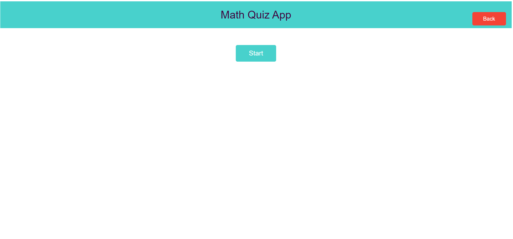

## 📝 Table of Contents

- [📝 Table of Contents](#-table-of-contents)
- [📙 About ](#-about-)
- [💻 Built Using ](#-built-using-)
- [📸 Demo Video ](#-demo-video-)
- [🕴 Contributors ](#-contributors-)
- [📃 License ](#-license-)

## 📙 About 

A basic quiz application for practicing basic math operations using ``VueJs``. It allows users to select a specific math operation (addition, subtraction, multiplication, or division) and the number of questions they want to answer.

## 💻 Built Using 

- **VueJs**

## 📸 Demo Video 

   

## 🕴 Contributors 

<table>
  <tr>
    <td align="center">
    <a href="https://github.com/ZiadSheriif" target="_black">
    
     
    <b>Ziad Sherif</b></a>
    </td>
    
    
  </tr>
 </table>

## 📃 License 

> This software is licensed under MIT License, See [License](https://github.com/ZiadSheriif/Math-Quiz/blob/main/LICENSE) for more information ©ZiadSheriif.